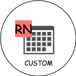

# React Native Custom Calendar

<center>



</center>

> A flexible & light weight calendar component for React Native


## Installation

Install with [npm](https://www.npmjs.com/):

```sh
$ npm install --save @skolacode/react-native-custom-calendar
```

Install with [yarn](https://yarnpkg.com):

```sh
$ yarn add @skolacode/react-native-custom-calendar
```


## Usage

```
import {View} from 'react-native';
import {CustomCalendar} from '@skolacode/react-native-custom-calendar'

const App = () => {
  return (
    <View>
      <CustomCalendar />
    </View>
  );
};
```


## Props

| Name         | Type         | Required | Default | Description                                                      |
| ------------ | ------------ | -------- | ------- | ---------------------------------------------------------------- |
| expand       | Boolean      | No       | true    | The state of the calendar view, either expanded or collapsed     |
| showNav      | Boolean      | No       | true    | Show the navigation buttons (only when header is not overwritten)|
| customHeader | ReactElement | No       | -       | Custom component to override default header                      |
| customDay    | ReactElement | No       | -       | Custom component to override default render of each day          |
| handlePress  | Function     | No       | -       | Custom function to trigger on pressed each day                   |

---


## Component Ref

```
import {useEffect} from 'react';
import {CustomCalendarRef} from '@skolacode/react-native-custom-calendar'

const App = () => {
  useEffect(() => {
    CustomCalendarRef.collapse();

    console.log(CustomCalendarRef.isExpanded()); // false
  }, []);
  
  return (
    <>
    </>
  );
};
```

Available properties & methods after component has mounted:

| Name           | Type         | Return  | Description                                                 |
| -------------- | ------------ | ------- | ----------------------------------------------------------- |
| current        | ReactElement | Object  | The calendar element itself                                 |
| expand         | Function     | Void    | Update the calendar to expanded state                       |
| collapse       | Function     | Void    | Update the calendar to collapsed state                      |
| isExpanded     | Function     | Boolean | Get current state (expanded / collapsed) of the calendar    |
| getSelectedDay | Function     | Object  | Get details of current active selected day                  |
| navigatePrev   | Function     | Void    | Navigate calendar to previous month                         |
| navigateNext   | Function     | Void    | Navigate calendar to next month                             |
| navigateMonth  | Function     | Void    | Navigate calendar to specific month                         |

---
